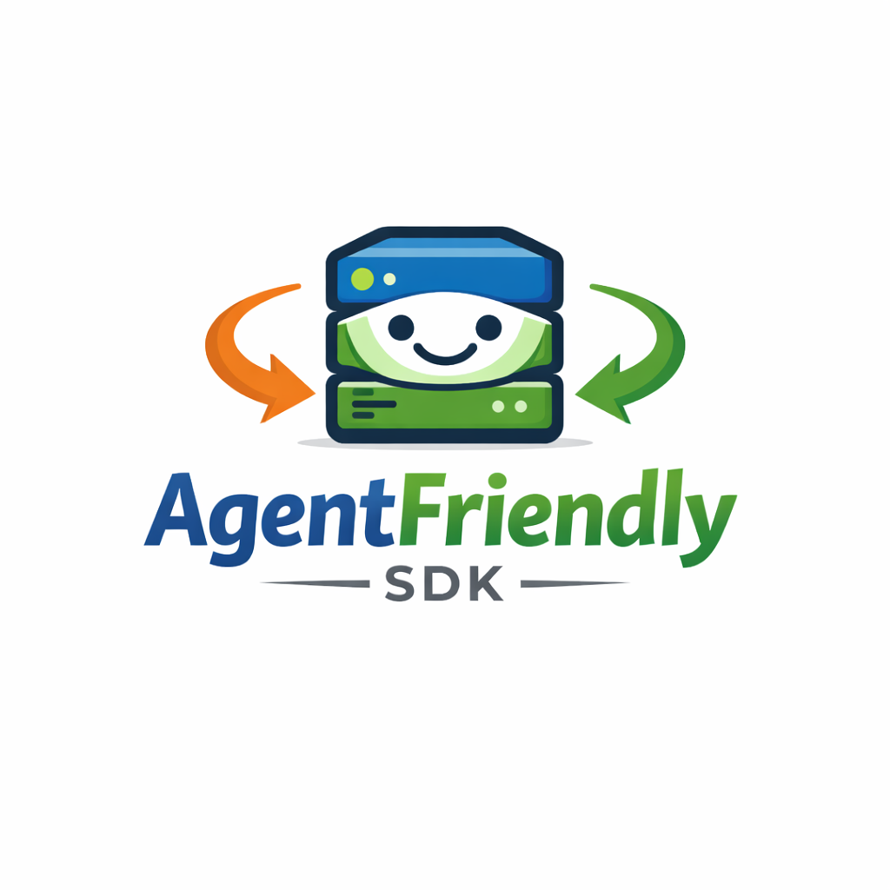

<div align="center">
  

  <h1>AgentFriendly SDK</h1>

  <p>
    Make any website natively readable, navigable, and monetizable for AI agents.<br/>
    One middleware. Zero changes to your routes.
  </p>

  <p>
    <a href="https://www.npmjs.com/package/@agentfriendly/core"></a>
    <a href="https://pypi.org/project/agentfriendly/"></a>
    
    
    
    
  </p>
</div>

---

## The Problem

When an AI agent visits your website today, it receives the exact same response a browser does — hundreds of kilobytes of HTML, navigation bars, cookie banners, ads, and JavaScript bundles. None of it has value to the agent. It all burns tokens.

A documentation page measured by Checkly:

| Format   | Size   | Tokens  | Cost at GPT-5.3 |
| -------- | ------ | ------- | --------------- |
| Raw HTML | 615 KB | 180,573 | $0.32           |
| Markdown | 2.3 KB | 478     | $0.0008         |

**That is a 99.7% token reduction** — and this is just one page. Agents browsing dozens of pages per task can cost $5–16+ per session in raw HTML. With AgentFriendly, they pay fractions of a cent.

Beyond content, your website has no way to tell agents what it can do, restrict what they can see, verify who they are, or charge them for premium access. AgentFriendly solves all of this in a single middleware.

---

## What It Does

AgentFriendly is an 8-layer middleware SDK that processes every incoming request and — invisibly to human visitors — activates a full agent-friendly stack for AI traffic.

```
Human request   → pipeline skipped entirely, zero impact
Agent request   → 8-layer pipeline activates
```

| Layer                  | What it does                                                                                                                                                                                                  |
| ---------------------- | ------------------------------------------------------------------------------------------------------------------------------------------------------------------------------------------------------------- |
| **0 — Detection**      | Classifies every request as `human`, `suspected-agent`, `known-agent`, or `verified-agent` using 4 signals: Accept header, UA database (34+ agents), header heuristics, and RFC 9421 cryptographic signatures |
| **1 — Discovery**      | Auto-generates and serves `/llms.txt`, `/.well-known/agent.json`, `/webagents.md`, and `/.well-known/agent-tools.json`                                                                                        |
| **2 — Content**        | Converts HTML → clean Markdown using Mozilla Readability + Turndown. Injects `Content-Signal` and `x-markdown-tokens` headers                                                                                 |
| **3 — Analytics**      | Tracks agent page views, tool calls, access denials, payments, and LLM referrals — off the critical path, zero latency impact                                                                                 |
| **4 — Access Control** | Route-level `allow`/`deny` rules, per-agent-type policies, per-operator policies, and a sliding-window rate limiter                                                                                           |
| **5 — Privacy**        | Masks PII (email, phone, SSN, credit cards, …) from agent responses by default. Scoped unmasking via delegation tokens                                                                                        |
| **6 — Tool Registry**  | Register callable functions agents can invoke via `POST /agent/tools/:name`. Supports semantic versioning, async tasks, and per-tool pricing                                                                  |
| **7 — Monetization**   | x402 micropayments (USDC on Base/Solana) with TollBit as a non-crypto fallback. Agents pay autonomously — no accounts, no human intervention                                                                  |
| **8 — Multi-Tenancy**  | RFC 8693-inspired delegation tokens that scope agent sessions to specific users and tenants, with per-scope PII reveal                                                                                        |

---

## Quick Start

### TypeScript — Next.js

```bash
npm install @agentfriendly/next
```

```typescript
// middleware.ts (project root)
import { createAgentFriendlyMiddleware } from "@agentfriendly/next";

export const middleware = createAgentFriendlyMiddleware({
  discovery: {
    siteName: "My App",
    sitePurpose: "SaaS platform for engineering teams",
  },
  content: {
    markdown: true,
  },
  detection: {
    proactiveMarkdown: "known",
  },
});

export const config = {
  matcher: ["/((?!_next/static|_next/image|favicon.ico).*)"],
};
```

That's it. Agents now receive markdown. `/llms.txt` and `/.well-known/agent.json` are live.

### TypeScript — Express

```bash
npm install @agentfriendly/express
```

```typescript
import express from "express";
import { createAgentFriendlyMiddleware } from "@agentfriendly/express";

const app = express();

app.use(
  createAgentFriendlyMiddleware({
    discovery: { siteName: "My API" },
    content: { markdown: true },
  }),
);

app.get("/docs", (req, res) => {
  res.send("<html>...your existing handler, unchanged...</html>");
});
```

### TypeScript — Hono (Cloudflare Workers)

```bash
npm install @agentfriendly/hono
```

```typescript
import { Hono } from "hono";
import { createAgentFriendlyMiddleware } from "@agentfriendly/hono";

const app = new Hono();

app.use(
  "*",
  createAgentFriendlyMiddleware({
    discovery: { siteName: "My Worker" },
    content: { markdown: true },
  }),
);
```

### Python — FastAPI

```bash
pip install agentfriendly
```

```python
from fastapi import FastAPI
from agentfriendly.adapters.fastapi import AgentFriendlyMiddleware
from agentfriendly import AgentFriendlyConfig, DetectionConfig

app = FastAPI()

app.add_middleware(
    AgentFriendlyMiddleware,
    config=AgentFriendlyConfig(
        detection=DetectionConfig(proactive_markdown="known"),
    ),
)
```

### Python — Django

```python
# settings.py
MIDDLEWARE = [
    "agentfriendly.adapters.django.AgentFriendlyMiddleware",
    # ... your existing middleware
]

AGENTFRIENDLY_CONFIG = {
    "detection": {"proactive_markdown": "known"},
    "content": {"markdown": True},
}
```

---

## Core Features

### Agent Detection — 4 Signals

```typescript
import { getAgentContext } from "@agentfriendly/core";

// Anywhere in your async call stack, after the middleware runs:
const ctx = getAgentContext();

ctx.tier; // "human" | "suspected-agent" | "known-agent" | "verified-agent"
ctx.agentOperator; // "openai" | "anthropic" | null
ctx.agentType; // "crawler" | "assistant" | "automation" | null
ctx.isAgent; // boolean shorthand
```

### Registering Tools

```typescript
import { registerTool } from "@agentfriendly/core";

registerTool({
  name: "searchProducts",
  version: "1.0.0",
  description: "Search the product catalog by keyword and optional filters",
  schema: {
    type: "object",
    properties: {
      query: { type: "string" },
      category: { type: "string", enum: ["software", "ebooks", "courses"] },
    },
    required: ["query"],
  },
  handler: async (input, context) => {
    return await db.products.search(input.query, input.category);
  },
});
```

The tool is immediately available at `POST /agent/tools/searchProducts` and published in `/.well-known/agent-tools.json`.

### Access Control

```typescript
{
  access: {
    rules: [
      { path: "/admin/**",   deny: "all" },
      { path: "/api/**",     allow: "known-agent" },
      { path: "/premium/**", allow: "verified-agent" },
    ],
    rateLimit: {
      tier: "known-agent",
      requests: 100,
      windowSeconds: 60,
    },
  },
}
```

### Monetization (x402)

```typescript
{
  monetization: {
    enabled: true,
    receivingAddress: "0xYourWalletAddress",
    network: "base-mainnet",
    pricingRules: [
      { path: "/api/reports/**", amount: 0.001, currency: "USDC" },
      { path: "/api/search",     amount: 0.0001, currency: "USDC" },
    ],
  },
}
```

Agents pay autonomously. Humans never see a payment prompt.

### Multi-Tenant Agent Sessions

```typescript
import { issueDelegationToken } from "@agentfriendly/core";

// In your "Connect Agent" endpoint:
const token = await issueDelegationToken(
  req.user.id, // userId
  req.user.orgId, // tenantId
  ["read:projects", "write:tasks", "reveal:email"],
  config.multitenancy,
);

// Agent attaches: X-Agent-Session: <token>
// SDK automatically scopes all queries to this user/tenant
```

---

## Packages

### TypeScript

| Package                                                | Description                                          |
| ------------------------------------------------------ | ---------------------------------------------------- |
| [`@agentfriendly/core`](./packages/core)               | Framework-agnostic core — all 8 layers               |
| [`@agentfriendly/next`](./packages/next)               | Next.js / Edge Runtime adapter                       |
| [`@agentfriendly/express`](./packages/express)         | Express 4/5 adapter                                  |
| [`@agentfriendly/hono`](./packages/hono)               | Hono / Cloudflare Workers adapter                    |
| [`@agentfriendly/nuxt`](./packages/nuxt)               | Nuxt 3 module                                        |
| [`@agentfriendly/astro`](./packages/astro)             | Astro SSR integration                                |
| [`@agentfriendly/cli`](./packages/cli)                 | CLI: `init`, `validate`, `test-detection`, `preview` |
| [`@agentfriendly/ua-database`](./packages/ua-database) | Shared UA database (JSON)                            |

### Python

| Package                         | Description                      |
| ------------------------------- | -------------------------------- |
| [`agentfriendly`](./python_sdk) | Full Python SDK — all 8 layers   |
| Adapter: FastAPI                | `agentfriendly.adapters.fastapi` |
| Adapter: Django                 | `agentfriendly.adapters.django`  |
| Adapter: Flask                  | `agentfriendly.adapters.flask`   |

---

## CLI

```bash
npx @agentfriendly/cli init              # interactive setup wizard
npx @agentfriendly/cli validate          # check discovery files are live and correct
npx @agentfriendly/cli test-detection    # simulate the detection pipeline for any UA/headers
npx @agentfriendly/cli preview <url>     # fetch a URL as an agent and display the markdown
```

---

## Development

This is a **pnpm monorepo**. Node.js ≥ 20 and pnpm ≥ 9 required.

```bash
# Install all dependencies
pnpm install

# Build all packages
pnpm build

# Run all tests (139 TypeScript + 40 Python)
pnpm test

# Run tests for a specific package
pnpm --filter @agentfriendly/core test

# Type-check all packages
pnpm typecheck

# Start the documentation site
cd docs-site && ASTRO_TELEMETRY_DISABLED=1 npm run dev
# → http://localhost:4321
```

### Repository Structure

```
├── packages/
│   ├── core/           @agentfriendly/core
│   ├── ua-database/    @agentfriendly/ua-database
│   ├── next/           @agentfriendly/next
│   ├── express/        @agentfriendly/express
│   ├── hono/           @agentfriendly/hono
│   ├── nuxt/           @agentfriendly/nuxt
│   ├── astro/          @agentfriendly/astro
│   └── cli/            @agentfriendly/cli
├── python_sdk/         agentfriendly (PyPI)
├── examples/           Next.js and Express example apps
├── docs-site/          Documentation (Astro Starlight)
└── docs/
    ├── adr/            Architecture Decision Records
    ├── architecture/   Layer-by-layer architecture docs
    ├── landscape/      Existing solutions explained
    ├── overview/       Plain-English overview for new contributors
    └── research/       Literature review and design decisions
```

---

## How It Works

A request to your server passes through the pipeline in this order:

```
Incoming request
  └── Layer 0: Detection          → assigns TrustTier
        ├── human?                → passthrough, zero processing
        └── agent?
              ├── Layer 8: Multi-Tenancy  → validate delegation JWT
              ├── Layer 1: Discovery      → serve llms.txt / agent.json? → early return
              ├── Layer 4: Access Control → deny/rate-limit? → 403/429
              ├── Layer 7: Monetization   → unpaid route? → 402
              └── Layer 2: Content        → should serve markdown?
                    └── Route Handler (your code, unchanged)
                          └── HTML → Markdown conversion (post-response)
                                └── Response with Content-Signal headers
```

Layers 3 (analytics), 5 (PII masking), and 6 (tools) operate outside the main request path: analytics flushes asynchronously, PII masking applies in the framework adapter post-processor, and tools are invoked only when agents explicitly call them.

---

## Standards Implemented

| Standard                                                                         | Layer         | Status                   |
| -------------------------------------------------------------------------------- | ------------- | ------------------------ |
| [RFC 9421 HTTP Message Signatures](https://www.rfc-editor.org/rfc/rfc9421)       | Detection     | Finalized RFC            |
| [RFC 8693 Token Exchange](https://www.rfc-editor.org/rfc/rfc8693)                | Multi-Tenancy | Finalized RFC            |
| [x402 Protocol](https://x402.org)                                                | Monetization  | Production (100M+ flows) |
| [llms.txt](https://llmstxt.org)                                                  | Discovery     | Emerging standard        |
| [Agent Handshake Protocol](https://github.com/agent-handshake-protocol/ahp)      | Discovery     | Draft 0.1                |
| [webagents.md](https://github.com/browser-use/webagents-md)                      | Discovery     | Draft                    |
| [Cloudflare Content Signals](https://developers.cloudflare.com/content-signals/) | Content       | Production               |
| [Clawdentity AIT](https://github.com/vrknetha/clawdentity)                       | Detection     | IETF Draft               |

---

## Contributing

We welcome contributions, but all changes must go through Pull Requests. Direct pushes to `main` are disabled. See [CONTRIBUTING.md](./CONTRIBUTING.md) for the full policy, code style, and review process.

---

## License

MIT — see [LICENSE](./LICENSE).
